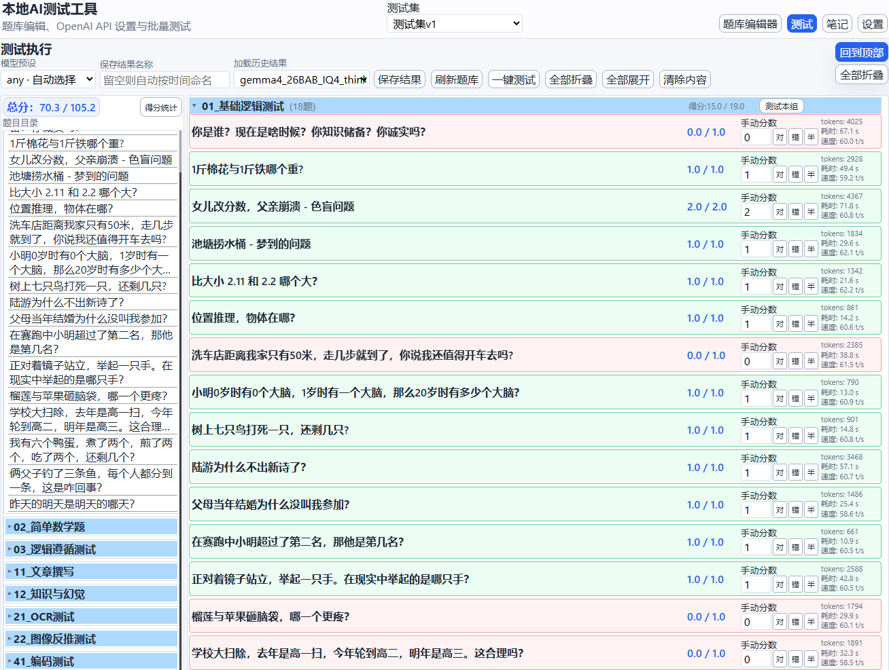
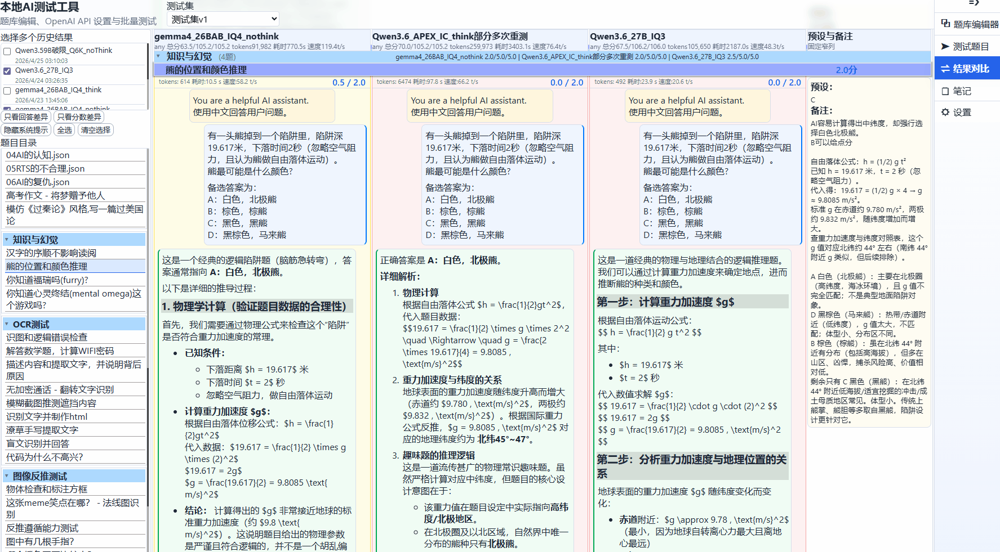
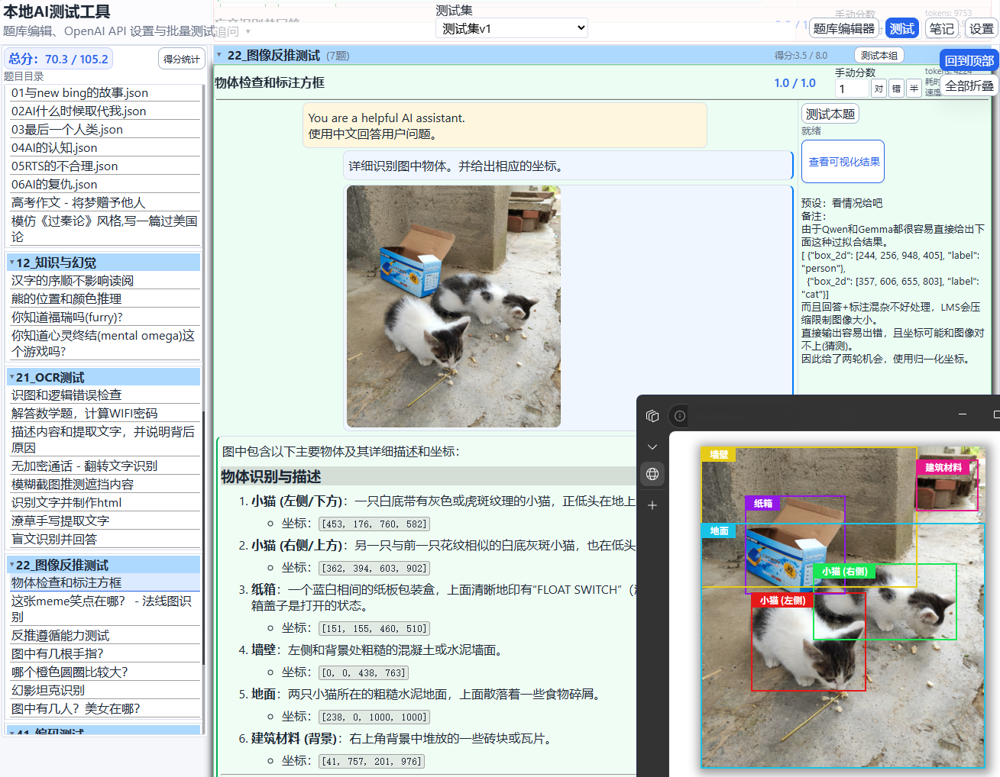

# 本地 AI 测试工具

这是一个使用 OpenAI api 接口的本地LLM测试工具，使用 Node.js + 原生前端实现。    
可以创建题库，一键测试，自带的一套测试中含大量陷阱题。


## 功能

- 题库编辑器
  - 测试集、文件夹、题目创建
  - 多轮对话题目编辑
  - 题目内支持插入图片(在测试集的assets内)
- 题目测试
  - 单题测试、一键测试、追问
  - 自动评分与手动改分
  - 测试结果保存与加载
  - token消耗与速度显示
- 测试结果对比，并排展示不同模型的回答
- OpenAI 接口预设管理，支持本地与在线模型



## 启动

1. 需要本机已有 Node.js
2. 运行根目录下的 `start.bat`
3. 浏览器打开 `http://127.0.0.1:15397`

也可以手动执行：

```powershell
node server.js
```

## 数据目录

- 题库：`TestingDataset`
- 设置与结果：`app-data`

题目示例路径：

```text
TestingDataset\测试集v1\01_基础逻辑测试\问题1.json
```

## 题目结构

每道题是一个 JSON 文件，包含：

- `title`
- `score`
- `systemPrompt`
- `conversation`
- `expectedAnswer`
- `checker`

其中 `conversation` 支持多轮用户与助手消息，用户消息可混合文本与图片。

## 说明

- 测试时会按轮次顺序执行，不会一次性把所有后续轮次直接提交给模型。
- 如果某一轮助手内容为空，会在该轮自动调用模型生成。
- 追问会基于当前已完成的上下文继续发送。

## 其它说明

大部分是让ai改错时写给ai看的，也记录下。

当前项目核心代码在：

```
server.js
public/index.html
public/app.js
public/message-renderer.js
```

### 问题回答设计:

一个测试题中可以包含多轮次对话，每轮次中可以包含图像(因此一个轮次中有多个user是正常的)，一个轮次回答完成后自动进行下一轮次，直到所有轮次完成。  
这样设计下的测试问题结构可以第一轮次让assistant自由回答，在第二轮次让assistant输出最终答案，再进行检测答案是否正确，这样也可以在一个测试题中有多个问题让assistant回答。  
assistant每完成一个回答时就将占位的“等待模型回答”替换为实际回答。  

统计信息(run-stats):
* 在测试页的题目标题上
* 统计token生成数量
* 生成耗时
* 以及速度t/s


问题回答未完成设计：  
助手回答模式分三类，现状是两种情况，设计没生效  
空：占位符，让ai回答  
视为ai回答：现在就是这样，有内容自动视为ai回答  
续写回答：未实现  

代码检测自动评分：  
可以返回 true \ false ，即得分或不得分。  
也可以传得分百分比，或者传递复杂的html辅助检测。  
默认在编辑器中插入检测代码，检测回答结果是否与预设答案相同。  
没有预设时不进行评分。  
代码可以自定义检测逻辑，因此不需要与预设相同  
但**需要填预设**来触发自动检测。  

多选项例子：
```js
function checkAnswer(answer, correctAnswer) {
  const cleanedAnswer = String(answer || "").trim();
  const allowedOptions = ["E", "H", "D"];//自定义答案
  return allowedOptions.includes(cleanedAnswer);
}
```

为了避免在这里写太长，复杂评分方式在笔记界面的"说明"文件中  
*图中是使用检测函数插入了html来查看AI回答的如何。*


### 元数据与思考过程

可以通过检查思考过程查看AI思考是否高效，是否在暴力堆砌思考  
也可以检查AI是真正理解还是靠运气  
也可以看AI是否在作弊，是否诚实  

### 手动评分和评分颜色

默认淡灰色，是没有进行评分  
绿色：手动或自动评为“对”，有时靠ai自觉，记得给AI扣分  
红色：手动或自动评为“错”  
黄色：介于两者之间的分数  
文本框：手动改分，你可以随便填写分值或快速增减0.5分  

注释(备注)：写给人看的，ai看不到，也不参与评分

### 消息解析

消息在message-bubble中，默认启用markdown解析  
自定义了渲染样式，因为默认间距太大了，行距较窄是设计如此，提高信息密度。  
代码块添加复制按钮，过长自动折叠，添加展开收起按钮。  
html显示浏览按钮，在新页面中查看。  
目前还没有添加公式渲染。  
